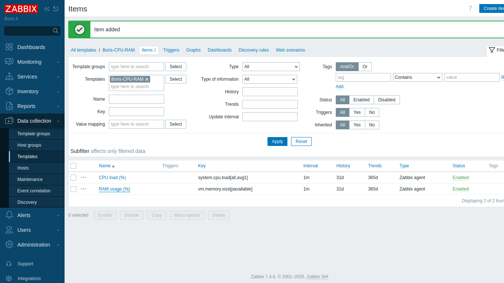
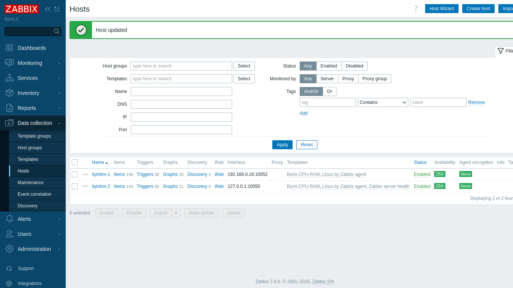
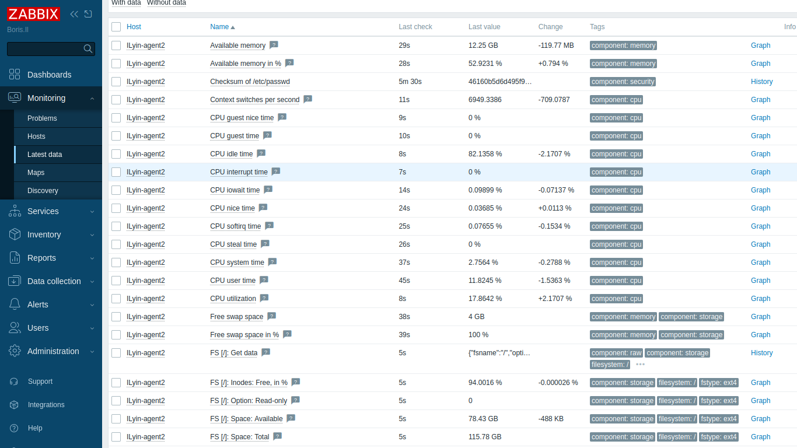
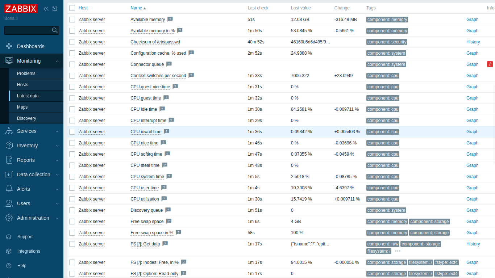
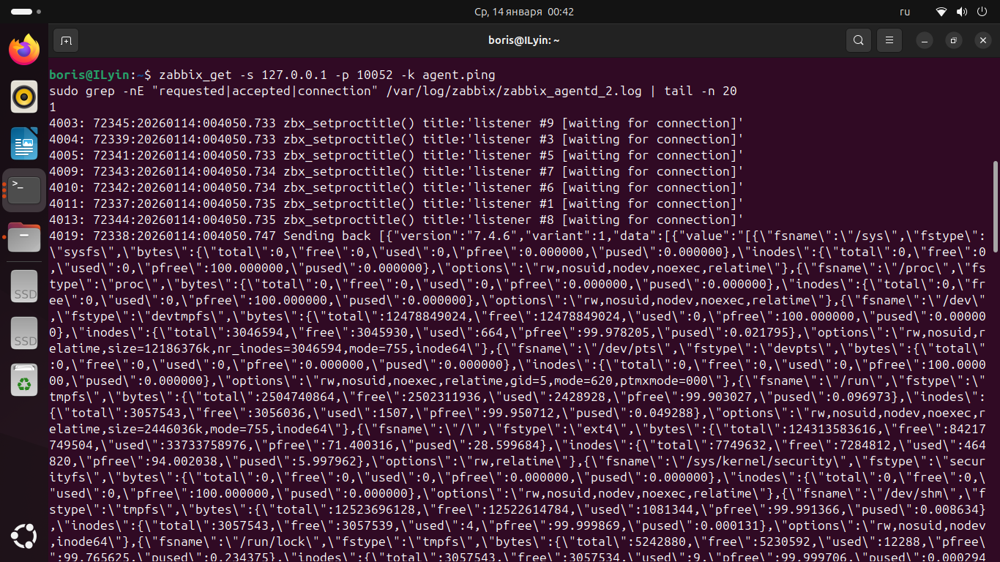

# Домашнее задание к занятию «Система мониторинга Zabbix» - `Ильин Борис`

### Инструкция по выполнению домашнего задания

   1. Сделайте `fork` данного репозитория к себе в Github и переименуйте его по названию или номеру занятия, например, https://github.com/имя-вашего-репозитория/git-hw или  https://github.com/имя-вашего-репозитория/7-1-ansible-hw).
   2. Выполните клонирование данного репозитория к себе на ПК с помощью команды `git clone`.
   3. Выполните домашнее задание и заполните у себя локально этот файл README.md:
      - впишите вверху название занятия и вашу фамилию и имя
      - в каждом задании добавьте решение в требуемом виде (текст/код/скриншоты/ссылка)
      - для корректного добавления скриншотов воспользуйтесь [инструкцией "Как вставить скриншот в шаблон с решением](https://github.com/netology-code/sys-pattern-homework/blob/main/screen-instruction.md)
      - при оформлении используйте возможности языка разметки md (коротко об этом можно посмотреть в [инструкции  по MarkDown](https://github.com/netology-code/sys-pattern-homework/blob/main/md-instruction.md))
   4. После завершения работы над домашним заданием сделайте коммит (`git commit -m "comment"`) и отправьте его на Github (`git push origin`);
   5. Для проверки домашнего задания преподавателем в личном кабинете прикрепите и отправьте ссылку на решение в виде md-файла в вашем Github.
   6. Любые вопросы по выполнению заданий спрашивайте в чате учебной группы и/или в разделе “Вопросы по заданию” в личном кабинете.
   
Желаем успехов в выполнении домашнего задания!
   
### Дополнительные материалы, которые могут быть полезны для выполнения задания

1. [Руководство по оформлению Markdown файлов](https://gist.github.com/Jekins/2bf2d0638163f1294637#Code)

---

###Задание 1

Установите Zabbix Server с веб-интерфейсом.
Процесс выполнения

  1  Выполняя ДЗ, сверяйтесь с процессом отражённым в записи лекции.
  2  Установите PostgreSQL. Для установки достаточна та версия, что есть в системном репозитороии Debian 11.
  3  Пользуясь конфигуратором команд с официального сайта, составьте набор команд для установки последней версии Zabbix с поддержкой PostgreSQL и Apache.
  4  Выполните все необходимые команды для установки Zabbix Server и Zabbix Web Server.

Требования к результатам

   1 Прикрепите в файл README.md скриншот авторизации в админке.
   2 Приложите в файл README.md текст использованных команд в GitHub.

##  Установка Zabbix Server + Web-интерфейс (PostgreSQL + Apache)

### Скриншот авторизации в админке
> Скриншот страницы логина Zabbix
`

### Использованные команды

#### Установка PostgreSQL (Debian 11)
 sudo apt update
 sudo apt install -y postgresql
 sudo systemctl enable --now postgresql
# Подключение репозитория Zabbix (7.4 LTS) для Debian 11
 wget https://repo.zabbix.com/zabbix/7.4/debian/pool/main/z/zabbix-release/zabbix-release_latest+debian11_all.deb
 sudo dpkg -i zabbix-release_latest+debian11_all.deb
 sudo apt update
# Установка Zabbix Server (PostgreSQL) + Web (Apache)
 sudo apt install -y zabbix-server-pgsql zabbix-frontend-php zabbix-apache-conf zabbix-sql-scripts zabbix-agent2
# Создание БД и пользователя
 sudo -u postgres createuser --pwprompt zabbix
 sudo -u postgres createdb -O zabbix zabbix
# Импорт схемы и данных
 zcat /usr/share/zabbix-sql-scripts/postgresql/server.sql.gz | sudo -u zabbix psql zabbix
# Настройка пароля к БД в Zabbix Server
 sudo sed -i 's/^# DBPassword=.*/DBPassword=netologyhomework/' /etc/zabbix/zabbix_server.conf
# Запуск сервисов
 sudo systemctl enable --now zabbix-server zabbix-agent2 apache2
 sudo systemctl restart zabbix-server apache2

### Задание 2

Задание 2

Установите Zabbix Agent на два хоста.
Процесс выполнения

   1 Выполняя ДЗ, сверяйтесь с процессом отражённым в записи лекции.
   2 Установите Zabbix Agent на 2 вирт.машины, одной из них может быть ваш Zabbix Server.
   3 Добавьте Zabbix Server в список разрешенных серверов ваших Zabbix Agentов.
   4 Добавьте Zabbix Agentов в раздел Configuration > Hosts вашего Zabbix Servera.
   5 Проверьте, что в разделе Latest Data начали появляться данные с добавленных агентов.

Требования к результатам

   1 Приложите в файл README.md скриншот раздела Configuration > Hosts, где видно, что агенты подключены к серверу
   2 Приложите в файл README.md скриншот лога zabbix agent, где видно, что он работает с сервером
   3 Приложите в файл README.md скриншот раздела Monitoring > Latest data для обоих хостов, где видны поступающие от агентов данные.
   4 Приложите в файл README.md текст использованных команд в GitHub
# Скриншот Data collection → Hosts 
`
# Скриншоты Monitoring → Latest data 
`
`
# Скриншот лога/проверки работы zabbix-agent2
`
# Установка zabbix-agent2
 sudo apt update
 sudo apt install -y zabbix-agent2
# ####
 sudo sed -i 's/^Server=.*/Server=192.168.0.16/' /etc/zabbix/zabbix_agentd_2.conf
 sudo sed -i 's/^ServerActive=.*/ServerActive=192.168.0.16/' /etc/zabbix/zabbix_agentd_2.conf
 sudo sed -i 's/^Hostname=.*/Hostname=ILyin-agent2/' /etc/zabbix/zabbix_agentd_2.conf

# Перезапуск и проверка статуса агента
 sudo systemctl enable --now zabbix-agent2
 sudo systemctl restart zabbix-agent2
 sudo systemctl is-active zabbix-agent2
 sudo ss -ltnp | egrep ':(10052)\b'
 sudo apt install -y zabbix-get
 zabbix_get -s 127.0.0.1 -p 10052 -k agent.ping
 sudo tail -n 200 /var/log/zabbix/zabbix_agentd_2.log

##### С НОВЫМ ГОДОМ !!!
