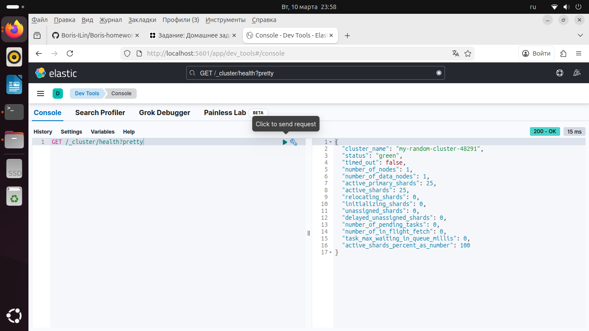

# Домашнее задание к занятию 2 «Кластеризация и балансировка нагрузки» - `Ильин Борис`

# Задание 1

    Запустите два simple python сервера на своей виртуальной машине на разных портах
    Установите и настройте HAProxy, воспользуйтесь материалами к лекции по ссылке
    Настройте балансировку Round-robin на 4 уровне.
    На проверку направьте конфигурационный файл haproxy, скриншоты, где видно перенаправление запросов на разные серверы при обращении к HAProxy.

# Задание 2

    Запустите три simple python сервера на своей виртуальной машине на разных портах
    Настройте балансировку Weighted Round Robin на 7 уровне, чтобы первый сервер имел вес 2, второй - 3, а третий - 4
    HAproxy должен балансировать только тот http-трафик, который адресован домену example.local
    На проверку направьте конфигурационный файл haproxy, скриншоты, где видно перенаправление запросов на разные серверы при обращении к HAProxy c использованием домена example.local и без него.
# Домашнее задание: HAProxy

## Задание 1 

# Решение

Сервера запущены на разных портах

  srv1 на 127.0.0.1:9001
  srv2 на 127.0.0.1:9002

    python3 server.py 9001 srv1
    python3 server.py 9002 srv2

    sudo apt update
    sudo apt install -y haproxy

# Задание 2 

 Сервера запущены на разных портах

   srv1 на 127.0.0.1:9001
   srv2 на 127.0.0.1:9002
   srv3 на 127.0.0.1:9003

    python3 server.py 9001 srv1
    python3 server.py 9002 srv2
    python3 server.py 9003 srv3
 
Добавление домена 
 
    echo "127.0.0.1 example.local" | sudo tee -a /etc/hosts
    getent hosts example.local  

