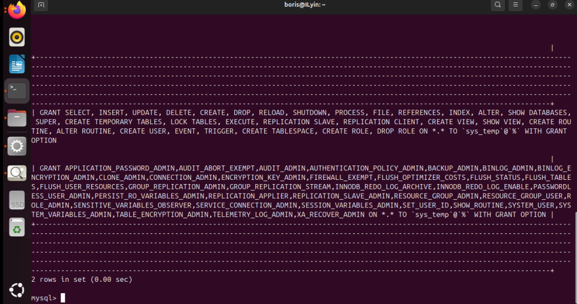
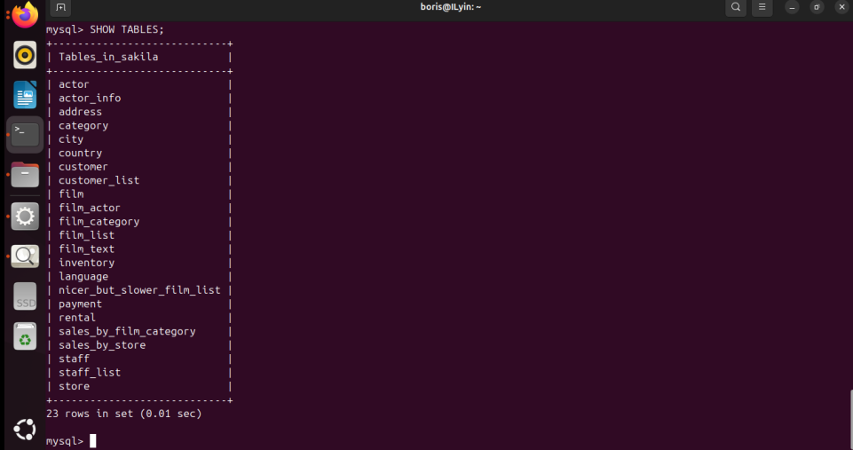

# Домашнее задание к занятию «Работа с данными (DDL/DML)»Ильин Б М

1.1. Поднимите чистый инстанс MySQL версии 8.0+. Можно использовать локальный сервер или контейнер Docker.

1.2. Создайте учётную запись sys_temp.

1.3. Выполните запрос на получение списка пользователей в базе данных. (скриншот)

1.4. Дайте все права для пользователя sys_temp.

1.5. Выполните запрос на получение списка прав для пользователя sys_temp. (скриншот)

1.6. Переподключитесь к базе данных от имени sys_temp.

Для смены типа аутентификации с sha2 используйте запрос:

ALTER USER 'sys_test'@'localhost' IDENTIFIED WITH mysql_native_password BY 'password';

1.6. По ссылке https://downloads.mysql.com/docs/sakila-db.zip скачайте дамп базы данных.

1.7. Восстановите дамп в базу данных.

1.8. При работе в IDE сформируйте ER-диаграмму получившейся базы данных. При работе в командной строке используйте команду для получения всех таблиц базы данных. (скриншот)

Результатом работы должны быть скриншоты обозначенных заданий, а также простыня со всеми запросами.
Задание 2

Составьте таблицу, используя любой текстовый редактор или Excel, в которой должно быть два столбца: в первом должны быть названия таблиц восстановленной базы, во втором названия первичных ключей этих таблиц. Пример: (скриншот/текст)

Название таблицы | Название первичного ключа
customer         | customer_id
 
# Задание 1

 1.1 Поднять чистый инстанс MySQL 8.0+(Docker)

docker run --name mysql8-sakila \
  -e MYSQL_ROOT_PASSWORD=rootpass \
  -p 3306:3306 \
  -d mysql:8.0

 1.2 Создать учётную запись sys_temp

CREATE USER 'sys_temp'@'%' IDENTIFIED BY 'TempPass_123!';

 1.3 Получить список пользователей

SELECT user, host FROM mysql.user;

 1.4 Дать все права для пользователя sys_temp

GRANT ALL PRIVILEGES ON *.* TO 'sys_temp'@'%' WITH GRANT OPTION;
FLUSH PRIVILEGES;

 1.5 Получить список прав для пользователя sys_temp

SHOW GRANTS FOR 'sys_temp'@'%';

 1.6 Переподключиться к базе данных от имени sys_temp

exit

docker exec -it mysql8-sakila mysql -usys_temp -pTempPass_123!

 1.6 Скачать дамп Sakila
 
 wget -O sakila-db.zip https://downloads.mysql.com/docs/sakila-db.zip
 unzip sakila-db.zip

 1.7 Восстановить дамп в базу данных

 docker exec -i mysql8-sakila mysql -uroot -prootpass < sakila-db/sakila-schema.sql
 docker exec -i mysql8-sakila mysql -uroot -prootpass < sakila-db/sakila-data.sql

 1.8 Получить список таблиц базы данных 

USE sakila;
SHOW TABLES;

#Задание 2

Список таблиц восстановленной базы и их первичных ключей.

SELECT
  kcu.TABLE_NAME AS table_name,
  kcu.COLUMN_NAME AS primary_key
FROM information_schema.TABLE_CONSTRAINTS tc
JOIN information_schema.KEY_COLUMN_USAGE kcu
  ON tc.CONSTRAINT_NAME = kcu.CONSTRAINT_NAME
 AND tc.TABLE_SCHEMA = kcu.TABLE_SCHEMA
 AND tc.TABLE_NAME = kcu.TABLE_NAME
WHERE tc.CONSTRAINT_TYPE = 'PRIMARY KEY'
  AND tc.TABLE_SCHEMA = 'sakila'
ORDER BY kcu.TABLE_NAME, kcu.ORDINAL_POSITION;
Скриншот команды 'curl -X GET

