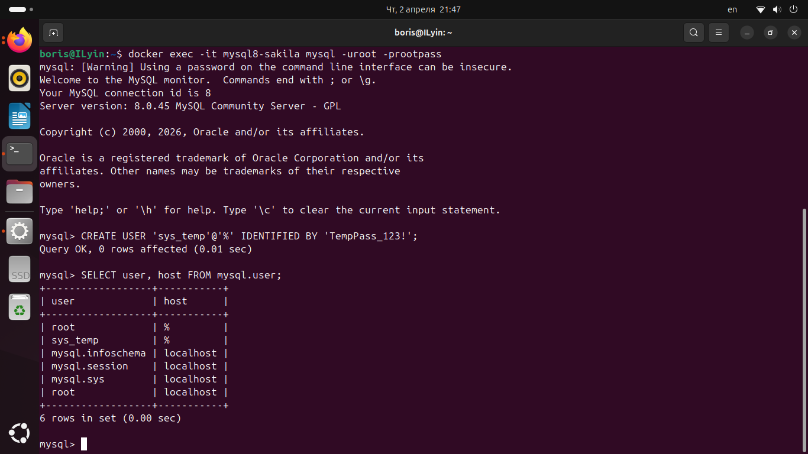
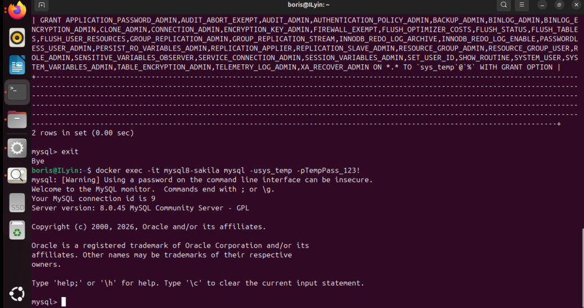
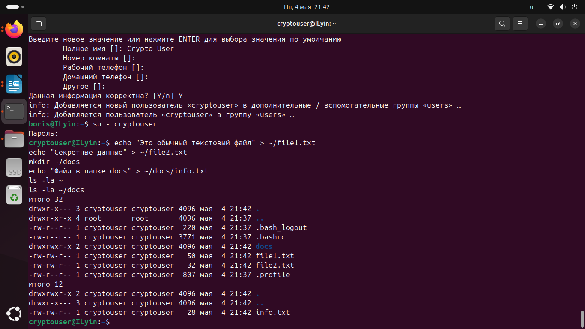

#Домашнее задание к занятию «Кеширование Redis/memcached»Ильин Б

Задание 1. Кеширование

Приведите примеры проблем, которые может решить кеширование.

Приведите ответ в свободной форме.
Задание 2. Memcached

Установите и запустите memcached.

Приведите скриншот systemctl status memcached, где будет видно, что memcached запущен.
Задание 3. Удаление по TTL в Memcached

Запишите в memcached несколько ключей с любыми именами и значениями, для которых выставлен TTL 5.

Приведите скриншот, на котором видно, что спустя 5 секунд ключи удалились из базы.
Задание 4. Запись данных в Redis

Запишите в Redis несколько ключей с любыми именами и значениями.

Через redis-cli достаньте все записанные ключи и значения из базы, приведите скриншот этой операции.

## Задание 1. Кеширование

Кеширование помогает, когда:
1 База данных или сервис перегружены частыми одинаковыми запросами.
2 Страницы отчёты долго считаются (можно сохранить готовый результат и отдавать быстрее).
3 Есть внешние API с ограничениями или высокой задержкой (кешируем ответы и реже дергаем API).
4 Много однотипных данных (например, список товаров и категорий)  можно быстро отдавать из кеша.
5 Нужно уменьшить задержки для пользователя (быстрее открываются страницы/приложение).

## Задание 2. Memcached

Установил и запустил memcached. 
Скриншот `systemctl status memcached`

## Задание 3. Удаление по TTL в Memcached

Записал несколько ключей с TTL = 5 секунд и проверил, что через 5 секунд они исчезают. 
Скриншот результата: 

## Задание 4. Запись данных в Redis

Записал несколько ключей в Redis и через `redis-cli` вывел ключи и значения.
Скриншот операции: 

